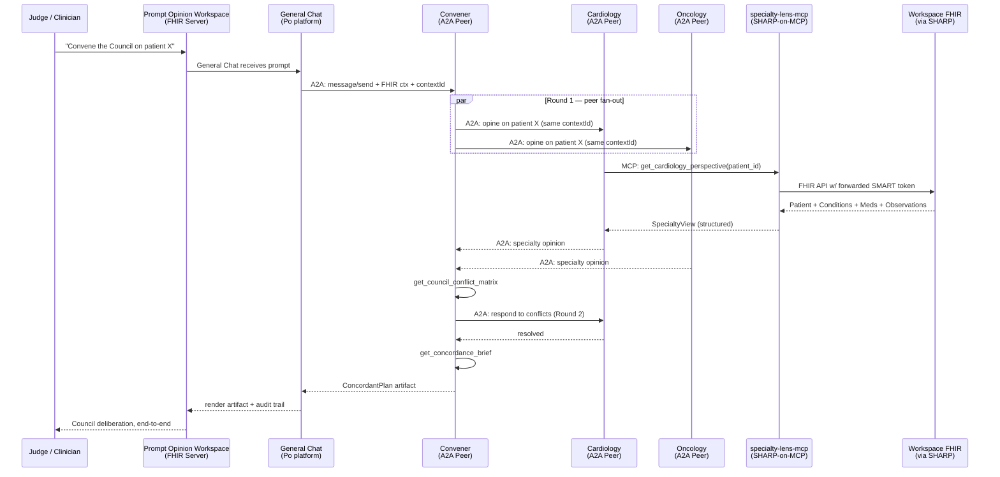

# The Council

> **A2A specialty convening for patients with too many doctors.**
> Tumor-board-grade reasoning for every multi-morbid patient — built on MCP, A2A, and FHIR.

[](LICENSE)
[](https://sharponmcp.com/)
[](https://a2a-protocol.org/latest/specification/)
[](https://hl7.org/fhir/R4/)
[](https://app.promptopinion.ai)

---

## What this is

Tumor boards exist because cancer is too complex for one mind. The same complexity exists everywhere else — and outside oncology, that multi-specialty negotiation doesn't happen at scale.

**The Council** is a peer agent-to-agent (A2A) network where independent specialty agents — Cardiology, Oncology, Nephrology, Endocrine, Obstetrics, Pediatrics, Psychiatry, Anesthesia — convene on a single multi-morbid patient and *negotiate* a concordant care plan in natural language. Each specialty is backed by a **Specialty Lens** MCP server (SHARP-on-MCP compliant). A lightweight **Convener** agent facilitates rounds and emits a structured `ConcordantPlan` artifact.

This is the architecture Prompt Opinion's docs describe ("A2A is for *independent* agents communicating, not orchestrator + sub-agents") — but that the platform's own reference repos don't yet demonstrate. **The Council is the first true peer-to-peer A2A demonstration on the platform.**

## Architecture



## Why this wins (judging criterion-by-criterion)

| Criterion | The Council's case |
|-----------|---------------------|
| **AI Factor** | Reasoning across conflicting specialty guidelines under multi-comorbidity is the canonical case where rule-based fails. Drug-interaction checkers catch pairs; specialty *recommendation reconciliation* requires reasoning over context, tradeoffs, and clinical judgment. |
| **Potential Impact** | ~60% of Medicare patients have 2+ chronic conditions; multi-morbid patients see 4–7 specialists who rarely coordinate; ~30% have at least one drug–drug interaction or directly conflicting recommendation. Tumor boards reduce cancer mortality precisely *because* they force multi-specialty negotiation — outside oncology, that doesn't happen at scale. The Council operationalizes the tumor-board model for every multi-specialist patient. |
| **Feasibility** | FHIR R4–native (every certified EHR exposes it). SHARP-on-MCP compliant — explicit 403 enforcement on missing FHIR context (the reference impls don't do this). Synthetic data only, no PHI. Architecture deployable to any cloud; here demonstrated on free-tier Hugging Face Spaces + Supabase + Sentry — proving the cost story for resource-constrained health systems. |

## The 5Ts mapping

The `ConcordantPlan` deliverable simultaneously produces three of the platform's 5Ts:

- **Template** — the structured concordant brief (the document)
- **Table** — the conflict matrix (specialty × specialty disagreements with resolutions)
- **Task** — clinician action items extracted from the brief

Three Ts in one artifact is a Council distinguishing property.

## Repo layout

```
council/
├── packages/
│   └── specialty-lens-mcp/     # SHARP-on-MCP TypeScript server
├── agents/                      # 9 Python A2A agents (ADK)
│   ├── shared/                  # AgentCard helpers, A2A wiring, FHIR hooks
│   ├── convener/                # Facilitator (NOT orchestrator)
│   ├── cardiology-agent/
│   ├── oncology-agent/
│   ├── nephrology-agent/
│   ├── endocrine-agent/
│   ├── obstetrics-agent/
│   ├── pediatrics-agent/
│   ├── psychiatry-agent/
│   └── anesthesia-agent/
├── fhir-bundles/                # Synthetic patients (Mrs. Chen + 3 archetypes)
├── docs/                        # Architecture, demo script, SHARP RFC
├── scripts/                     # Deploy, ping, schema migrate
└── .github/workflows/           # CI + cron pinging to keep HF Spaces warm
```

## Try it

- **Live demo:** [Marketplace listings under `council-health-ai`](https://app.promptopinion.ai)
- **3-minute video:** *(link added at submission)*
- **Devpost writeup:** *(link added at submission)*

## Run locally

```bash
# Prereqs: Node 20+, Python 3.11+, Docker, pnpm, uv
make install
make dev-mcp     # in one terminal
make dev-agents  # in another
```

## SHARP-on-MCP compliance

The MCP server advertises **both** the spec form (`capabilities.experimental.fhir_context_required.value: true`) and the implementation form used by the Prompt Opinion platform (`capabilities.extensions["ai.promptopinion/fhir-context"]`). The divergence between the two is documented and proposed for reconciliation in our [SHARP extension RFC](docs/sharp-extension-coin-rfc.md).

The server enforces a real **403 Forbidden** on missing FHIR-context headers at request entry — none of the three reference implementations (TypeScript, Python, .NET in `prompt-opinion/po-community-mcp`) currently do this.

## A2A native peer dialogue

Each specialty agent has its own Agent Card at both `/.well-known/agent-card.json` (v1) and `/.well-known/agent.json` (v0 backcompat). The Convener uses `A2ACardResolver` + `ClientFactory.create(card).send_message()` for **deterministic peer fan-out** — not delegated routing through `RemoteA2aAgent` (which is Gemini-routed and non-deterministic).

A custom A2A extension `https://council-health.ai/schemas/a2a/v1/coin` declares each agent's role in a Council deliberation, enabling future composability across builders.

## Acknowledgments

The Council builds on the architectural pattern Microsoft popularized in the [Healthcare Agent Orchestrator](https://github.com/Azure-Samples/healthcare-agent-orchestrator) (Blondeel, Lungren et al., 2025), but inverts the orchestrator-vs-specialist topology to peer-to-peer A2A — closer to the language-first interoperability vision Josh Mandel champions in [SMART on FHIR](https://scholar.harvard.edu/jmandel/publications/smart-fhir-standards-based-interoperable-apps-platform-electronic-health) (Mandel et al., JAMIA 2016) and Banterop than to HAO's group-chat orchestration.

## License

[MIT](LICENSE)
